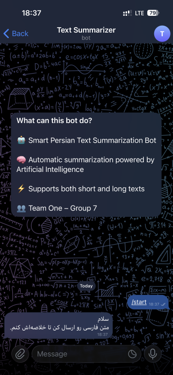
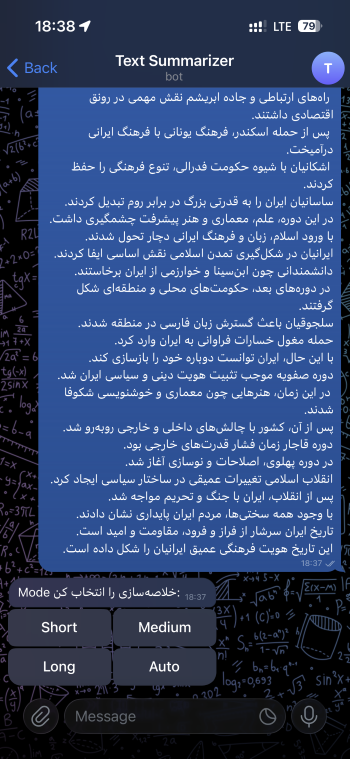
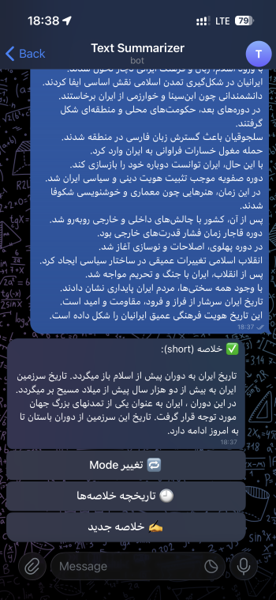
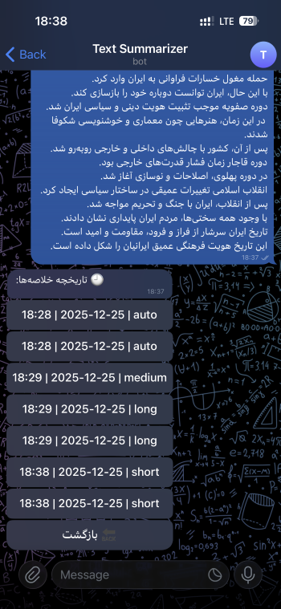

# Group 7 – Team One


## Text Summarizer (telegram bot)

### Members
- Mohammad Armin Shojaee (leader)
- Soroush Haghani
- Fatemeh Nejati
- Ehsan MoghadamNia
- Alireza KianPishe

---

## 📌 Overview

This project is a **Persian Text Summarization System** with an integrated **Telegram Bot interface**.  
The system is designed to automatically generate concise and meaningful summaries for Persian texts using **neural abstractive summarization**.

To handle both short and long texts efficiently, the project adopts a **hierarchical summarization approach**:
- Short texts are summarized directly using a sequence-to-sequence neural model.
- Long texts are split into smaller chunks, summarized individually, and then summarized again to produce a final coherent summary.

The core summarization engine is  powered by a pre-trained Transformer-based model trained on Persian summarization data.

The system supports multiple summarization modes (short, medium, long, and auto) and performs Persian-specific text preprocessing to improve output quality.

This project was developed as an academic NLP project by **Team One**, focusing on clean architecture, modular design, and real-world usability through a Telegram bot.

---

## 📌 System Flow
The system follows a hierarchical summarization pipeline designed to efficiently handle Persian texts of varying lengths. The overall flow is as follows:

1.User Input (telegram_bot.py)

The user provides a Persian text along with a preferred summarization mode (short, medium, long, or auto).

2.Text Length Routing (length_router.py)

The input text is first normalized and tokenized using the model’s tokenizer.
Based on the total token count, the system determines whether the input text is considered short or long.
A fixed threshold of 450 tokens is used:
If the token count is ≤ 450, the text is routed to the direct summarization pipeline.
If the token count is > 450, the text is routed to the chunk-based summarization pipeline.

3.Direct Summarization Path (direct_summarizer.py)

For short texts, the system performs single-pass abstractive summarization:
.The text is normalized using shared preprocessing utilities.
.The entire input is fed directly to the summarization model.
.Output length is controlled based on the selected mode (short, medium, long, or auto).
.The final summary is generated in one decoding step.

4.Chunk-Based Summarization Path (chunk_summarizer.py)

For long texts, a two-stage summarization strategy is applied:

- Stage 1 – Chunking and Intermediate Summaries:
The normalized input text is tokenized and split into overlapping chunks, each within the model’s token limit.
Each chunk is summarized independently, producing a set of intermediate summaries.

- Stage 2 – Final Summary Generation:
All intermediate summaries are merged into a single text.
This merged text is summarized again to produce a coherent final summary.
Output length is dynamically controlled based on the selected mode and the total input length.

5.Shared NLP Backbone (model.py)

Both summarization pipelines rely on a shared transformer-based model and tokenizer.
The model is loaded once and reused across all components to ensure consistency and efficiency.

6.Text Normalization (preprocess.py)

Persian text normalization is applied wherever required to reduce noise and improve summary quality.
This includes character normalization, symbol cleanup, whitespace normalization, and handling Persian-specific formatting issues.

7.Final Output

The generated summary is returned to the user in Persian, with length and detail level aligned to the selected summarization mode.

---

## 📌 Requirements

This project requires **Python 3.8+** and the following libraries:

- **torch**  
  Required as the deep learning backend for the transformer model.

- **transformers**  
  Used for loading the pretrained Persian sequence-to-sequence summarization model and tokenizer.

- **python-telegram-bot**  
  Provides the Telegram bot interface, message handling, and inline keyboards.

- **re** (built-in)  
  Used for Persian text normalization and symbol cleanup.

- **math** (built-in)  
  Used for adaptive summary length calculations.


###  Installation
```bash
pip install torch transformers python-telegram-bot
```

---
## 📌 Core Components

This section describes the main Python modules and their responsibilities in the system.


## `model.py` — Model and Tokenizer Loader

Serves as the shared NLP backbone of the entire system.

Details:
- Loads the pretrained transformer-based summarization model:
  `m3hrdadfi/bert2bert-fa-wiki-summary`
- Loads the corresponding tokenizer using Hugging Face Transformers
- Exposes the model and tokenizer as global objects

All other modules import from this file to ensure consistency and efficient resource usage.


## `preprocess.py` — Persian Text Normalization

Provides text normalization utilities specifically designed for Persian language processing.

Responsibilities:
- Removing Zero Width Non-Joiner characters (half-space)
- Normalizing Arabic characters to their Persian equivalents
- Removing unnecessary symbols while preserving sentence punctuation
- Normalizing whitespace

This preprocessing step reduces tokenization inconsistencies and improves summarization quality.


## `length_router.py` — Text Length Router

Implements lightweight routing logic to select the appropriate summarization strategy.

Responsibilities:
- Normalizing the input Persian text
- Counting tokens using the shared tokenizer
- Comparing the token count against a fixed threshold of **450 tokens**

Routing logic:
- **Short texts (≤ 450 tokens)** → Direct summarization
- **Long texts (> 450 tokens)** → Chunk-based summarization

This module enables adaptive summarization without unnecessary computation.


## `direct_summarizer.py` — Direct (Single-Pass) Summarization

Handles summarization for short Persian texts using a single decoding step.

Processing flow:
- Normalize input text using `preprocess.py`
- Tokenize and truncate input to the model’s maximum length (512 tokens)
- Generate the summary using beam search decoding
- Control output length via modes (`short`, `medium`, `long`, `auto`)

This approach is efficient and preserves coherence for short documents.


## `chunk_summarizer.py` — Chunk-Based (Hierarchical) Summarization

Designed for summarizing long Persian texts that exceed the model’s token limit.

Strategy:
- Split normalized text into overlapping token chunks
- Summarize each chunk independently (Stage 1)
- Merge all intermediate summaries
- Re-summarize the merged text to generate a final coherent summary (Stage 2)

Output length is dynamically controlled based on the selected summarization mode.


## `telegram_bot.py` — Telegram Bot Interface

Implements the user-facing Telegram bot that integrates all system components.

Key features:
- Handles the `/start` command and user interactions
- Receives Persian text messages from users
- Provides inline buttons for selecting summarization modes
- Automatically routes text to direct or chunk-based summarization
- Maintains in-memory user summary history (text, mode, timestamp)
- Supports mode switching, history viewing, and starting new summaries

This module connects the NLP pipeline to a real-world interactive interface.

---
## 📌 Bot Commands

The Telegram bot supports both slash commands and interactive inline buttons
to provide an easy and user-friendly summarization experience.


### Slash Commands

| Command | Description |
|--------|-------------|
| `/start` | Starts the bot and prompts the user to send a Persian text for summarization. |


### Inline Button Actions

After sending a Persian text, the bot presents several inline buttons that control the summarization process.

#### Summarization Modes
- **Short**  
  Generates a very concise summary.
- **Medium**  
  Produces a balanced-length summary.
- **Long**  
  Creates a more detailed summary.
- **Auto**  
  Automatically determines summary length based on input size.


#### Post‑Summary Actions

After a summary is generated, the following options are available:

- **🔁 Change Mode**  
  Re-generates the summary for the same text using a different mode.

- **🕘 Summary History**  
  Displays a list of previously generated summaries in the current session.

- **✍️ New Summary**  
  Clears the current context and prompts the user to send a new text.


#### History Navigation

When viewing summary history:
- Users can select a specific past summary to view both the original text and its generated summary.
- A **Back** button allows returning to the previous menu or summary.


### Notes
- The bot automatically routes texts based on their length.
- Short texts are summarized directly, while long texts use chunk-based summarization.
- User history is stored in memory and is cleared when the bot restarts.

---

## 📌 Telegram Bot Screenshots

### 1. Bot Start Command


### 2. send text


### 3. Mode Selection Interface


### 4. Generated Summary


### 5. Summary History


---
## 📌 Limitations

Despite its effectiveness, the project has several limitations:

- The underlying Transformer model accepts a maximum of 512 tokens per input.  
  Long texts require chunk-based summarization, which may slightly reduce global coherence.

- The summarization quality depends on a pretrained model that has not been
  fine-tuned specifically for this project or domain.

- No automatic evaluation metrics (e.g., ROUGE) are currently implemented.
  Output quality has been assessed qualitatively.

- In the Telegram bot, user history is stored only in memory and is lost when the bot restarts.

- Running the model on CPU can be slow, especially for long texts that require multi-stage summarization.

---

## 📌 Future Work

Possible directions for improving the project include:

- Fine-tuning the summarization model on Persian-domain-specific datasets.
- Incorporating automatic evaluation metrics such as ROUGE for quantitative analysis.
- Adding persistent storage (e.g., SQLite or PostgreSQL) for Telegram user data.
- Supporting additional input formats such as TXT, PDF, and DOCX files.
- Improving the chunking strategy using sentence- or paragraph-level segmentation.
- Enhancing the user interface with advanced controls or a web-based frontend.

---

### 🧑‍💻 Author

Soroush Haghani

---
